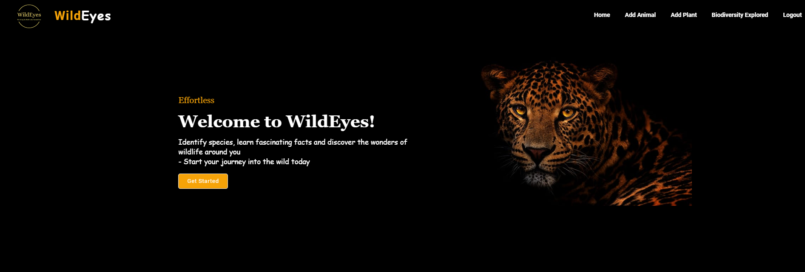
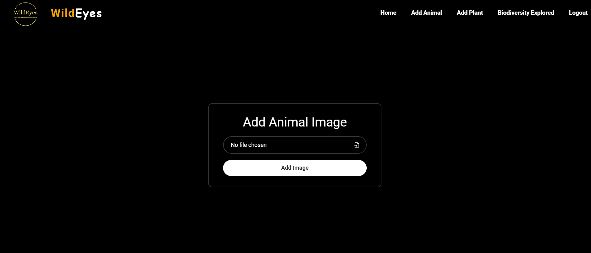
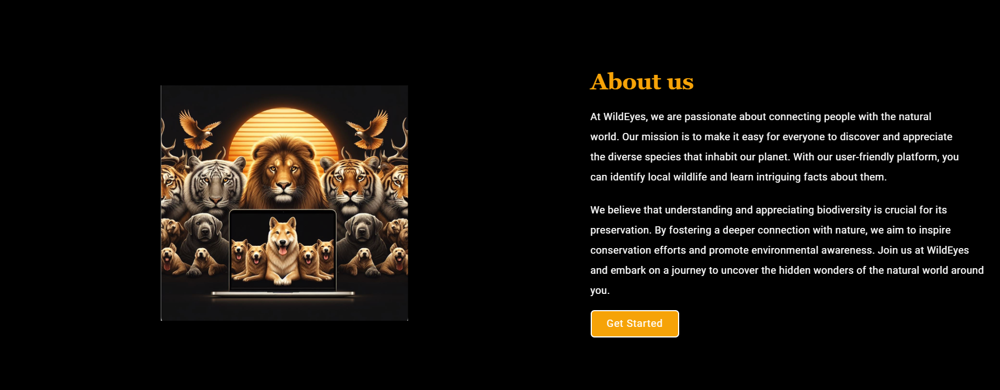
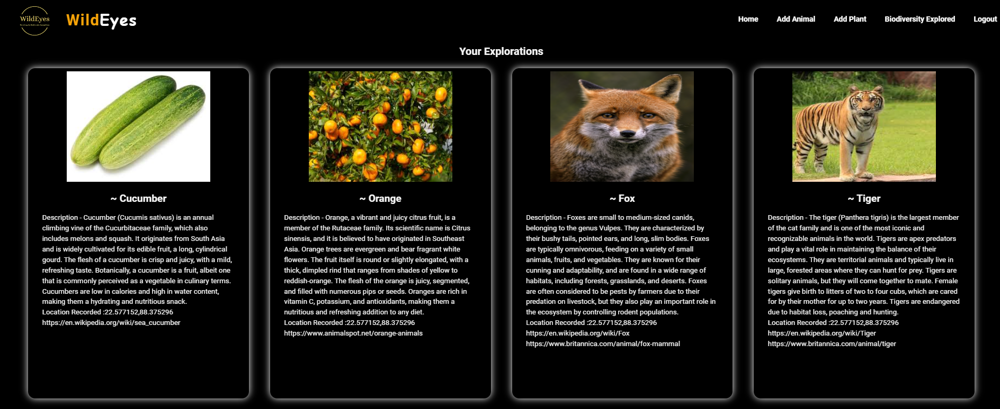

# Wild Eyes 🌿🐾

**Identify species, learn fascinating facts, and discover the wonders of wildlife around you. Start your journey into the wild today!**

[Watch the Video Demo](#-youtube-demo) | [Explore the GitHub Repository]()

---

## The Problem Wild Eyes Solves

Many of us are unable to appreciate the biodiversity in our surroundings due to a lack of taxonomic knowledge. Even with the curiosity to inquire, our efforts are limited by language barriers in areas where we encounter exotic species, and we are often unsure about the authenticity of available resources. This creates a disconnect from the natural world's rich biodiversity.

Wild Eyes bridges this gap by providing a seamless, accurate, and informative identification tool that quenches a user's thirst for knowledge.

---

## 📸 Screenshots & Demo Video

### Application Screenshots

| **Home Page**                                       | **Upload & Identify**                                           |
| :--------------------------------------------------: | :--------------------------------------------------------------: |
|  |  |
| **Species Result**                                  | **User's Explorations**                                         |
|  |  |

### YouTube Demo

Watch the full video demonstration of Wild Eyes in action, from user registration to species identification.

---

## ✨ Key Features

*   **AI-Powered Species Identification**: Upload an image of an animal or plant to get an accurate species identification in seconds.
*   **Rich, Dynamic Content**: Receive a concise, AI-generated summary about the identified species.
*   **Further Reading**: Get curated links from the web for deeper exploration.
*   **Geolocation Tagging**: Each identification is tagged with the user's current latitude and longitude.
*   **Personal Exploration Dashboard**: All identified species are saved to a personal dashboard, creating a log of your discoveries.
*   **Secure User Authentication**: JWT-based authentication ensures that your explorations are private and secure.

---

## 🛠️ Tech Stack & Architecture

### Frontend

| Component        | Technology/Library                                          | Purpose                                                                |
| :--------------- | :---------------------------------------------------------- | :--------------------------------------------------------------------- |
| **Framework**    | React.js                                                    | Building a dynamic and responsive user interface.                        |
| **Build Tool**   | Vite                                                        | Fast and efficient development and build process.                      |
| **Routing**      | React Router                                                | For seamless single-page application navigation.                        |
| **Styling**      | Tailwind CSS, MUI, MDBootstrap, Emotion, Custom CSS         | A utility-first CSS framework for rapid UI development and custom styling. |
| **Animations**   | AOS (Animate on Scroll)                                     | To create engaging scroll animations.                                  |
| **Form Management**| React Hook Form with Zod                                  | For robust and schema-validated forms.                                 |
| **HTTP Client**  | Axios                                                       | For making API requests to the backend.                                |
| **Icons**        | Font Awesome, React Icons                                   | Enhancing the UI with a rich set of icons.                             |

### Backend

| Component        | Technology/Library                   | Purpose                                                                      |
| :--------------- | :----------------------------------- | :--------------------------------------------------------------------------- |
| **Framework**    | Flask                                | A lightweight and powerful web framework for Python.                         |
| **Database**     | MySQL                                | For storing user data and records of their explorations.                     |
| **Authentication** | Flask-Bcrypt, Flask-JWT-Extended     | Secure password hashing and token-based user authentication.                 |
| **ML/DL**        | TensorFlow/Keras                     | The core engine for building and running our species detection models.       |
| **APIs**         | Google Generative AI (Gemini Pro), SerpApi, Cloudinary | For AI-powered descriptions, web search results, and cloud image storage. |

### 🧠 Core Models: Species Recognition

The heart of Wild Eyes lies in its highly accurate species detection models. We built two distinct classifiers—one for animals and one for plants—using state-of-the-art deep learning techniques.

*   **Model Architecture**: Both models are **Convolutional Neural Networks (CNNs)**, ideal for image recognition.
*   **Transfer Learning**: We employed **transfer learning** using the pre-trained **VGG16** model as our base. VGG16's training on the extensive ImageNet dataset gives it a powerful ability to recognize features like edges, textures, and shapes.
*   **Fine-Tuning**: We then **fine-tuned** this base model by adding custom **Dense, Flatten, and Dropout layers**. These layers were trained on our specific animal and plant datasets, adapting the model for our specific task.
*   **Data Augmentation**: To make the models more robust and prevent overfitting, we used Keras's **ImageDataGenerator** to artificially expand the training dataset by shearing, zooming, and flipping images.